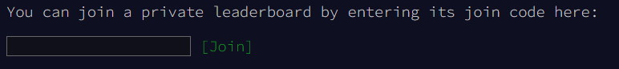

# My Advent Of Code Answers (2024)

## What is Advent Of Code?

> Advent of Code is an Advent calendar of small programming puzzles for a variety of skill levels that can be solved in any programming language you like. People use them as interview prep, company training, university coursework, practice problems, a speed contest, or to challenge each other.

Join now at: https://adventofcode.com/

## My answers
Most of my answers are written with Python.

## My Advent Of Code User
```BlueRobin```

## My private leaderboard
Go to: https://adventofcode.com/2024/leaderboard/private

Enter: 

```
4418459-cb76a003
```